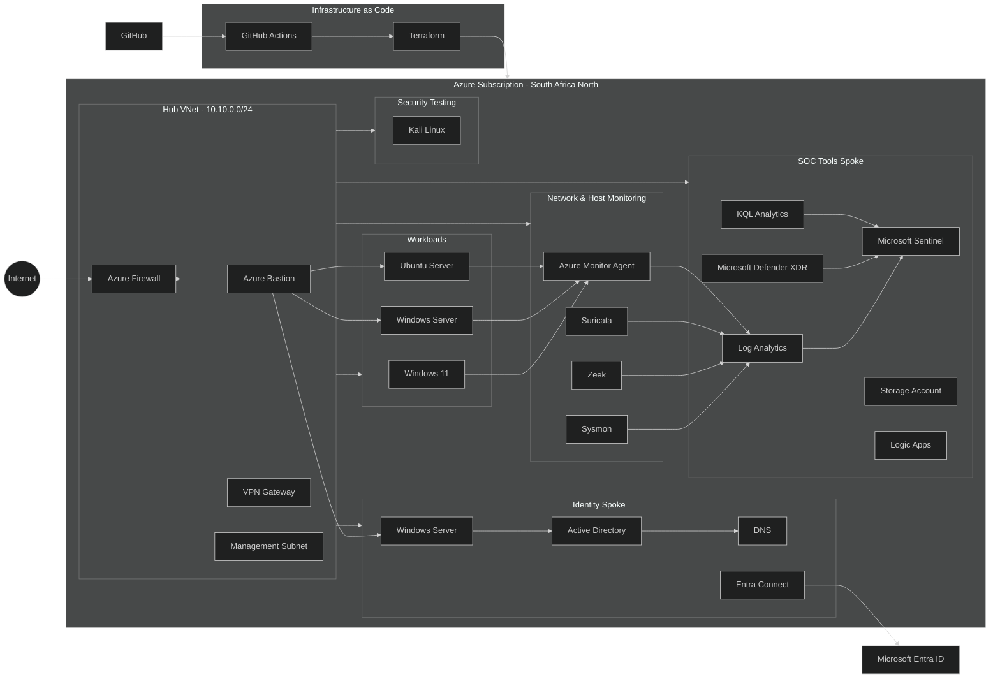

# Sentinel Hub Lab

A hands-on Azure SOC lab I'm building to understand how infrastructure, networking, telemetry and security monitoring come together in a realistic environment.

This project is intentionally focused. The goal isn't to recreate an entire enterprise environment or implement every component at production depth.

The goal is to build enough of the environment to generate realistic activity, collect useful security telemetry, and use Microsoft Sentinel to investigate what is happening.

**Status: Work in progress**

----------

## What I'm Building

The lab is based on a small **hub-and-spoke architecture in Azure South Africa North**.

It includes:

-   Azure Firewall
    
-   Azure Bastion
    
-   VPN Gateway
    
-   Hub and spoke networking
    
-   Active Directory
    
-   DNS
    
-   Microsoft Entra ID
    
-   Windows and Linux workloads
    
-   Kali Linux for controlled security testing
    
-   Sysmon
    
-   Zeek
    
-   Suricata
    
-   Azure Monitor Agent
    
-   Log Analytics
    
-   Microsoft Sentinel
    
-   Microsoft Defender XDR
    
-   Storage
    
-   Logic Apps
    
-   KQL
    
-   Terraform
    
-   GitHub Actions
    

Not every component will be explored to the same depth.

Some components exist to provide the surrounding infrastructure and context for the SOC. Others are areas I intend to explore more deeply.

----------

## The Problem I'm Trying to Solve

The main question behind this project is simple:

> **If something happens in the environment, can I see it, understand what happened, investigate it and respond?**

A logistics environment can contain users, endpoints, servers, networks, branches and cloud services, all generating activity.

From a SOC perspective, I want to be able to answer questions such as:

-   What happened?
    
-   Where did it happen?
    
-   Which system was involved?
    
-   What evidence do we have?
    
-   What activity happened before and after the event?
    
-   Can the activity be detected?
    
-   What should the analyst do next?
    

This lab gives me somewhere to work through those questions.

----------

# Architecture



The architecture is intentionally broader than the initial implementation.

The purpose is to give the lab a realistic structure while allowing individual components to be developed as I progress.

----------

# Hub Network

The Hub VNet acts as the central network for the environment.

It contains:

-   Azure Firewall
    
-   Azure Bastion
    
-   VPN Gateway
    
-   Management connectivity
    

The hub provides the central point through which the different spokes and services can communicate.

----------

# Identity

The Identity Spoke provides a small enterprise-style identity environment.

It includes:

-   Windows Server
    
-   Active Directory Domain Services
    
-   DNS
    
-   Microsoft Entra ID
    
-   Entra Connect
    

The purpose is to create realistic identity-related activity that can eventually be monitored and investigated through the SOC.

----------

# Workloads

The workloads represent systems that a SOC analyst could be responsible for monitoring.

Current planned workloads include:

-   Windows 11 endpoint
    
-   Windows Server
    
-   Ubuntu Server
    

These systems provide different operating-system environments and generate different types of telemetry.

----------

# Security Testing

Kali Linux is included as a controlled testing system.

It is not intended to represent a production workload.

Its purpose is to generate controlled activity against the lab so that I can investigate what that activity looks like from the SOC side.

The emphasis is on:

**Activity → Telemetry → Detection → Investigation**

----------

# Security Monitoring

The monitoring layer is where the lab starts becoming useful from a SOC perspective.

The environment includes:

### Sysmon

Used to provide detailed Windows host telemetry.

### Zeek

Used to provide network visibility and protocol-level information.

### Suricata

Used for network security monitoring and alert generation.

### Azure Monitor Agent

Used to collect and forward telemetry into Azure monitoring services.

----------

# Microsoft Sentinel

Microsoft Sentinel is the central security monitoring platform for the lab.

The intention is to use Sentinel for:

-   Log collection
    
-   Analytics
    
-   Detection
    
-   Investigation
    
-   Threat hunting
    
-   Incident management
    

KQL will be used to query and investigate the collected telemetry.

The objective isn't simply to create alerts.

I want to understand **why an alert exists, what evidence supports it and how an analyst would investigate it.**

----------

# Defender XDR

Microsoft Defender XDR is included as part of the wider security architecture.

It provides another source of security telemetry and allows me to explore how endpoint and Microsoft security signals can complement Sentinel.

This component will remain relatively focused rather than becoming a separate Defender project.

----------

# Automation & Storage

The architecture also includes:

-   Azure Storage
    
-   Logic Apps
    

These components provide a foundation for exploring retention and security automation later in the project.

They are included in the architecture but are not the primary focus of the lab.

----------

# Infrastructure as Code

Terraform is part of the project because I want to learn how to build and manage Azure infrastructure as code.

**Terraform is new to me.**

I haven't previously worked with it before, so this project is also an opportunity to learn it by actually using it.

The initial goal is straightforward:

> Define the lab infrastructure in Terraform and make the environment reproducible.

I don't intend to turn this into an advanced Terraform project.

The focus is on learning the fundamentals and applying them to a real environment.

----------

# GitHub Actions

GitHub Actions is also new territory for me.

I'm using it to learn how automation can fit around the project.

The current workflow automatically renders the Mermaid architecture diagrams when the source diagram changes.

The longer-term goal is to use GitHub Actions alongside Terraform so that infrastructure changes can eventually be validated and managed through the repository.

This will be developed gradually as I learn.

----------

# Repository Structure

```text
sentinel-hub-lab/
│
├── .github/
│   └── workflows/
│       └── render-diagram.yml
│
├── diagrams/
│   ├── architecture.mmd
│   ├── architecture.svg
│   └── architecture.png
│
├── terraform/
│   └── ...
│
├── detections/
│   └── ...
│
├── hunting/
│   └── ...
│
├── incidents/
│   └── ...
│
├── README.md
└── LICENSE

```

The repository structure will evolve as the lab develops.

----------

# Planned Workflow

The overall workflow for the lab is:

```text
Infrastructure
      ↓
Azure Environment
      ↓
Workloads
      ↓
Security Activity
      ↓
Telemetry
      ↓
Log Analytics
      ↓
Microsoft Sentinel
      ↓
Detection
      ↓
Investigation
      ↓
Response

```

The objective is to connect these pieces together rather than treating each technology as an isolated exercise.

----------

# Current Progress

### Completed

-   Initial architecture
    
-   Mermaid architecture diagram
    
-   GitHub repository structure
    
-   Automated Mermaid rendering with GitHub Actions
    

### In Progress

-   Azure infrastructure design
    
-   Terraform learning
    
-   Terraform infrastructure
    
-   Network implementation
    
-   Identity implementation
    
-   Security telemetry pipeline
    

### Planned

-   Sentinel configuration
    
-   Detection rules
    
-   KQL investigations
    
-   Threat hunting
    
-   Controlled security activity
    
-   Incident investigation
    
-   Basic response automation
    

----------

# Scope

This is intentionally a **focused SOC lab**.

It is not intended to be:

-   A production-ready enterprise architecture
    
-   A complete Azure security implementation
    
-   An advanced Terraform project
    
-   A complete DevSecOps platform
    
-   A replacement for a real SOC environment
    

The purpose is to build, experiment, investigate and learn.

Some components will be implemented deeply.

Others will remain at a practical introductory level.

That's intentional.

----------

# What I'm Learning

This project brings several areas together:

-   Azure networking
    
-   Azure security
    
-   Windows and Linux administration
    
-   Active Directory
    
-   Microsoft Entra ID
    
-   Security telemetry
    
-   Network monitoring
    
-   Microsoft Sentinel
    
-   KQL
    
-   Terraform
    
-   GitHub Actions
    
-   Detection and investigation
    

The project is being built incrementally.

I'm learning some of these technologies for the first time, particularly **Terraform and GitHub Actions**, so the repository will reflect that learning process.

----------

# Project Philosophy

I'm not trying to build everything at once.

The approach is simple:

**Build → Test → Break → Investigate → Fix → Document**

The end goal is not to have the biggest lab.

It's to have a lab I can explain.

I want to be able to look at every major component and understand:

-   Why it is there
    
-   What it does
    
-   What telemetry it produces
    
-   How that telemetry reaches the SOC
    
-   What an analyst can do with it
    

That's what I'm building towards.
