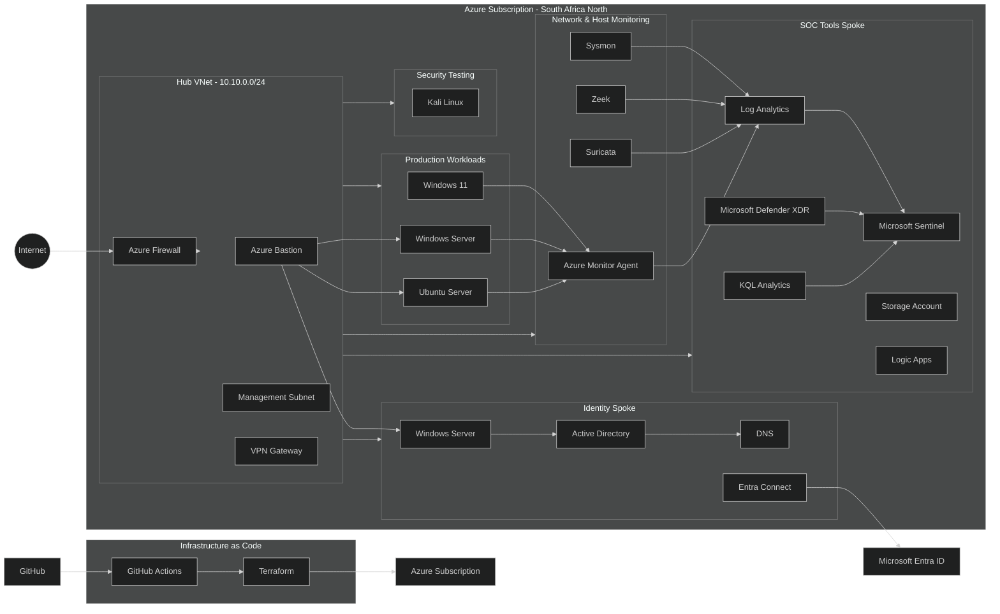

# Sentinel Hub Lab

A hands-on Azure SOC lab I built to understand how infrastructure, networking, telemetry and security monitoring come together in a realistic environment.

This project was intentionally focused. The goal was never to recreate an entire enterprise environment or implement every component at production depth but was to build enough of the environment to generate realistic activity, collect useful security telemetry, and use Microsoft Sentinel to investigate what's happening.

**Status: Paused**

Azure Firewall, Bastion, VPN Gateway and running virtual machines cost real money the moment they exist, whether or not I'm actively using them. This is a self-funded lab, not something with a company card behind it, and I made the decision to stop rather than continue paying for infrastructure simply to keep an unfinished environment running.

The network and identity layers were built and verified properly before I stopped. This isn't an abandoned half-attempt but a deliberate pause at a real working milestone.

----------

## What I Set Out to Build

A small hub-and-spoke architecture in Azure South Africa North:

-   Azure Firewall, Bastion and hub-and-spoke networking
    
-   VPN Gateway
    
-   Active Directory, DNS and Microsoft Entra ID
    
-   Windows and Linux workloads
    
-   Kali Linux for controlled security testing
    
-   Sysmon, Zeek and Suricata
    
-   Azure Monitor Agent feeding Log Analytics
    
-   Microsoft Sentinel
    
-   Microsoft Defender XDR
    
-   Storage and Logic Apps for retention and automation
    
-   KQL for investigation and hunting
    
-   Terraform for infrastructure as code
    
-   GitHub Actions for repository automation
    

The architecture was intentionally broader than what I ultimately implemented. Some components were infrastructure foundations, while others were intended to become part of the later detection, investigation and response workflow.

----------

## The Problem I'm Trying to Solve

> If something happens in the environment, can I see it, understand what happened, investigate it and respond?

From a SOC perspective, I want to be able to answer:

-   What happened?
    
-   Where did it happen?
    
-   Which system was involved?
    
-   What evidence do we have?
    
-   What activity happened before and after?
    
-   Can the activity be detected?
    
-   What should the analyst do next?
    

The lab was designed to give me a controlled environment in which to work through those questions.

----------

# Architecture



This is the **full planned architecture**, not a claim that every component shown above was completed.

The sections below distinguish between what was actually built and verified and what remained planned when development was paused.

----------

## What's Actually Built and Verified

### Network

The core Azure network foundation was successfully deployed.

This included:

-   Hub VNet
    
-   Identity Spoke
    
-   Production Workloads spoke
    
-   VNet peering
    
-   Azure Firewall
    
-   Azure Bastion
    
-   Management connectivity
    
-   VPN Gateway
    

The VPN Gateway was subsequently removed after confirming that nothing in the environment was actually using it. It was consuming Azure spend without providing value to the current build, so removing it was a deliberate engineering decision rather than a failed deployment.

### Identity

DC1 was promoted to a real Active Directory forest and verified using actual Windows and Active Directory diagnostics, including:

-   `Get-ADDomain`
    
-   `Get-ADDomainController`
    
-   Active Directory service checks
    

A second Windows Server was domain-joined and its secure channel was verified using:

```text
nltest /sc_query

```

The identity layer therefore moved beyond simply deploying virtual machines and it was genuinely functioning infrastructure.

### Telemetry

The telemetry foundation was partially implemented.

This included:

-   Log Analytics workspace
    
-   Data Collection Rule
    
-   Azure Monitor Agent
    
-   Windows event collection configuration
    

The Data Collection Rule was corrected and verified against Microsoft's documented configuration after the stream name was initially incorrect.

One known issue remained open: the Azure Monitor Agent Windows service was not registering correctly on the Windows VMs despite Azure reporting successful deployment. This issue is documented in the `incidents/` directory rather than being hidden.

### Infrastructure as Code

Terraform reached a full clean deployment:

```text
Apply complete! Resources: 24 added, 0 changed, 0 destroyed.

```

The project also used a remote Terraform state backend in Azure Storage so state could survive across sessions.

The build encountered real infrastructure problems along the way, including configuration and resource issues. These were diagnosed, corrected and redeployed rather than simply bypassed.

Terraform was new to me going into this project, so this became a practical exercise in understanding:

-   Resource dependencies
    
-   Terraform state
    
-   Plans and applies
    
-   Provider behaviour
    
-   Azure resource constraints
    
-   Remote state
    
-   Infrastructure troubleshooting
    

### Workloads

An Ubuntu Server VM was successfully deployed into its own workload spoke.

Zeek and Suricata installation commands were run against the Ubuntu VM, but full installation and telemetry verification were not completed before the project was paused.

----------

# What's Not Built

The following components remained unfinished when development stopped:

-   Kali Linux
    
-   Full Sysmon deployment and validation
    
-   Complete Zeek telemetry integration
    
-   Complete Suricata telemetry integration
    
-   Microsoft Sentinel enablement
    
-   Microsoft Defender XDR integration
    
-   Storage and evidence-retention workflows
    
-   Logic Apps response automation
    
-   Windows 11 endpoint
    
-   Detection rules
    
-   KQL hunting content
    
-   Incident investigation workflows
    
-   Automated response
    
-   Network-wide traffic monitoring
    

A full plain-language explanation of the remaining components and what implementing them would involve is documented in WHATS-LEFT.md

The broader build journey, troubleshooting and intended detection scenarios are documented in RETROSPECTIVE.md

----------

# Repository Structure

```text
sentinel-hub-lab/
│
├── .github/
│   └── workflows/
│       └── render-diagram.yml
│
├── diagrams/
│   ├── architecture.mmd
│   ├── architecture.svg
│   └── architecture.png
│
├── terraform/
│   └── ...
│
├── detections/
│   └── ...
│
├── hunting/
│   └── ...
│
├── incidents/
│   └── ...
│
├── RETROSPECTIVE.md
├── WHATS-LEFT.md
├── README.md
└── LICENSE

```

The repository structure reflects both the implemented infrastructure foundation and the planned SOC workflow.

----------

# Infrastructure as Code

Terraform was new to me going into this meaning, I hadn't used it professionally before.

The goal was to define the lab as code and make the environment reproducible, not to create an advanced Terraform project for its own sake.

It was genuinely tested through the build:

-   Real deployment failures
    
-   Real configuration problems
    
-   Real Azure constraints
    
-   Real state management issues
    
-   Real fixes
    
-   A remote state backend created during the project
    

The final clean deployment reached:

```text
24 resources added
0 resources changed
0 resources destroyed

```

That gave me practical experience with what actually happens when infrastructure as code meets a real cloud environment.

----------

# GitHub Actions

GitHub Actions was also new territory for me.

The current workflow automatically renders the Mermaid architecture diagram when the source diagram changes.

The longer-term intention was to use GitHub Actions alongside Terraform for infrastructure validation and automation.

That stage was not reached before the project was paused.

----------

# Planned SOC Workflow

The intended workflow for the complete lab was:

```text
Infrastructure
      ↓
Azure Environment
      ↓
Workloads
      ↓
Security Activity
      ↓
Telemetry
      ↓
Log Analytics
      ↓
Microsoft Sentinel
      ↓
Detection
      ↓
Investigation
      ↓
Response

```

The purpose was to connect these pieces together rather than treat each technology as an isolated exercise.

The project reached the **infrastructure, networking, identity and early telemetry stages**, but it did not reach a completed end-to-end detection and response workflow.

----------

# Scope

This was never intended to be:

-   A production-ready enterprise architecture
    
-   A complete Azure security implementation
    
-   An advanced Terraform project
    
-   A complete DevSecOps platform
    
-   A replacement for a real SOC environment
    

The purpose was to build, experiment, investigate and learn.

Some components were intended to be implemented deeply.

Others were intentionally going to remain at a practical introductory level.

That distinction was part of the design.

----------

# What I'm Learning

This project brought several areas together:

-   Azure networking
    
-   Azure security
    
-   Windows and Linux administration
    
-   Active Directory
    
-   Microsoft Entra ID
    
-   Security telemetry
    
-   Network monitoring
    
-   Microsoft Sentinel
    
-   KQL
    
-   Terraform
    
-   GitHub Actions
    
-   Detection and investigation
    

The project also taught me something that is difficult to learn from a certification course alone:

**how to debug infrastructure when the error message isn't the answer.**

There were situations where the first deployment failed, the apparent fix wasn't enough, state no longer matched reality, resources had to be rebuilt, and the actual problem had to be isolated before continuing.

That troubleshooting process became one of the most valuable parts of the build.

----------

# Project Philosophy

**Build → Test → Break → Investigate → Fix → Document**

The goal was never to have the biggest lab.

It was to have a lab I could explain.

I wanted to be able to look at every major component and understand:

-   Why it is there
    
-   What it does
    
-   What telemetry it produces
    
-   How that telemetry reaches the SOC
    
-   What an analyst could do with it
    

For the infrastructure and identity components that were completed, that objective was achieved.

----------

# Why the Project Was Paused

Azure infrastructure costs are part of the reality of building cloud-based labs.

Services such as Azure Firewall, Bastion, VPN Gateway and running virtual machines continue to incur costs while they are provisioned.

This was a **self-funded project**.

There was no company subscription or infrastructure budget behind the lab, and keeping the environment running while continuing development would eventually become financially unsustainable.

Rather than leave the infrastructure running purely so the repository could appear to be "in progress", I made the decision to stop the deployment and preserve the work.

The project was therefore **canned because of funding constraints, not because the architecture or infrastructure failed**.

Before stopping, I made sure that the major completed layers were properly tested and documented.

That distinction matters.

The project did not reach its original end state, but the work that was completed was real, functional and verified.

----------

# Final State

The final state of the project is the **Azure infrastructure and early identity foundation** of the planned SOC environment.

The infrastructure deployment successfully reached:

```text
Apply complete! Resources: 24 added, 0 changed, 0 destroyed.

```

At the point development stopped:

-   The Azure network foundation was deployed.
    
-   Hub and workload VNets were successfully connected.
    
-   Azure Firewall was operational.
    
-   Azure Bastion was deployed.
    
-   VPN Gateway had been deployed and later removed intentionally.
    
-   Windows Server infrastructure was deployed.
    
-   Active Directory was promoted and verified.
    
-   A second Windows Server was domain-joined and verified.
    
-   Log Analytics and the telemetry foundation were implemented.
    
-   An Ubuntu workload was deployed.
    
-   Terraform infrastructure management was functioning.
    
-   GitHub repository automation was functioning.
    
-   The remaining unfinished work was documented.
    

The project therefore isn't presented as a fully completed SOC platform.

It is presented as a **working infrastructure milestone that was intentionally paused**.

The unfinished scope is documented and preserves the build journey and lessons learned.

Rather than hide the unfinished components, they remain visible so that anyone reviewing the repository can see exactly where the project stopped and why.

Sometimes the right engineering decision isn't to keep something running.

It's knowing when the cost of continuing no longer makes sense, stopping responsibly, documenting what was achieved, and taking the knowledge forward.

----------

# Licence

MIT
